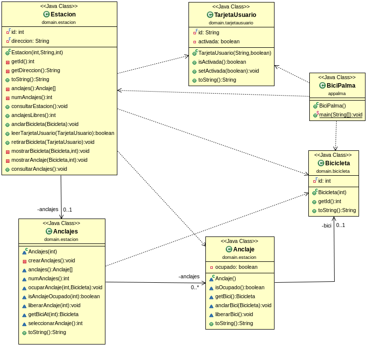

# Bicipalma

## Examen programación Java

Examen de programación DAW Dual Java de febrero de 2014, CIFP Francesc de Borja Moll, Palma (Illes Balears).

- Arrays estáticos
- Tipos primitivos
- loops
- SRP
- OCP
- Tiene una /has-a
- Composición (agregación fuerte)
- TDD :(
- Refactorización
- Gradle sourceSets

## DDD

### Consideraciones

Se trata de una refactorización de un código Java antiguo, el que correspondía a dicho examen, ideado para ser resuelto con los conocimientos básicos de Java que el alumnado poseía por aquel entonces.

Se ha aplicado DDD, SRP y OCP para destilar las responsabilidades en rutinas testeables.

Se añadieron los casos test mínimos que corresponden a las historias de usuario que se indican en el `main`. No se empleó TDD.

Se utilizó como práctica para crear una configuración de Gradle con una estructura de directorios que no respeta la convención sobre configuración que emplean Maven y Gradle.

No se emplea programación funcional, ni existe control de errores (ni recursos asociados como `Optional`), ni estructuras de datos dinámicas porque se trata de un proyecto de aprendizaje para alumnado que inicia su andadura en Java.
